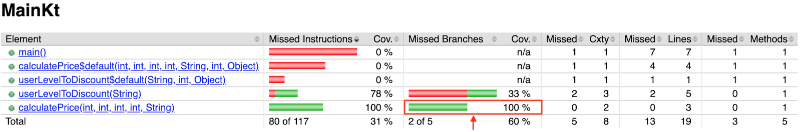

# Домашнее задание к занятию «2.1. Автотесты, работа с отладчиком и Continuous Integration»

В качестве результата пришлите ссылки на ваши GitHub-проекты в личном кабинете студента на сайте [netology.ru](https://netology.ru).

**Важно**: ознакомьтесь со ссылками на главной странице [репозитория с домашними заданиями](../README.md).

Если у вас что-то не получилось, то оформляйте Issue [по установленным правилам](../report-requirements.md).

Не делайте ДЗ всех занятий в одном репозитории! Иначе потом будет сложно подключать системы Continuous Integration.

## Как сдавать задачи

1. Создайте на вашем компьютере Gradle-проект.
1. Инициализируйте в нём пустой Git-репозиторий.
1. Добавьте в него готовый файл [.gitignore](../.gitignore).
1. Добавьте в этот же каталог остальные необходимые файлы.
1. Сделайте необходимые коммиты.
1. Создайте публичный репозиторий на GitHub и свяжите свой локальный репозиторий с удалённым.
1. Сделайте пуш и удостоверьтесь, что ваш код появился на GitHub.
1. Ссылку на ваш проект отправьте из личного кабинета на сайте [netology.ru](https://netology.ru).
1. Необязательные задачи можно не сдавать — это не повлияет на получение зачёта. В этом ДЗ все задачи обязательные.

## Задача №1 - Максимальное покрытие

Вам нужно взять уже полюбившуюся функцию расчёта комиссии при переводе и написать для неё автотесты:

Подключите JUnit4 и JaCoCo. Добейтесь того, чтобы покрытие кода по branch было не менее 80%:

Информацию о том, что значит по branch вы найдёте на [официальном сайте JaCoCo](https://www.eclemma.org/jacoco/trunk/doc/counters.html).

Итог: у вас должен быть репозиторий на GitHub, в котором будет ваш Gradle-проект. Автотесты также должны храниться в репозитории.

В случае возникновения проблем с генерацией отчёта, смотрите [соответствующий раздел](https://github.com/netology-code/kt-homeworks/blob/master/04_functions/README.md#%D0%B2%D0%BE%D0%B7%D0%BC%D0%BE%D0%B6%D0%BD%D1%8B%D0%B5-%D0%BF%D1%80%D0%BE%D0%B1%D0%BB%D0%B5%D0%BC%D1%8B-%D0%B8-%D0%B8%D1%85-%D1%80%D0%B5%D1%88%D0%B5%D0%BD%D0%B8%D1%8F)

## Задача №2 - CI

Запускать тесты на своём компьютере - хорошо, а запускать их при каждом пуше в облаке – ещё лучше. Когда вы будете работать в команде, сразу будет видно, кто «сломал» сборку, а кто прислал "«нерабочий PR (Pull-Request)». В этом вся прелесть командной работы 😈!

Мы настроим CI на базе GitHub Actions - уже встроенной в GitHub системы.

Соответственно, ваша задача - подключить к вашему репозиторию GitHub Actions, следуя пошаговой инструкции, которая была приведена выше.

Чтобы удостовериться, что CI действительно работает - добавьте (как мы в примере) коммит, ломающий сборку (выставьте в тестах неправильное ожидаемое значение). Убедитесь, что после Push вам покажут эту проблему.

**Важно**: вам не нужно каждый раз создавать заново файл конфигурации GitHub Actions, достаточно добавлять его в новый репозиторий так же, как вы это делаете с `.gitignore`.

Итог:
1. У вас должен быть репозиторий на GitHub, в котором расположен ваш Gradle-проект.
1. К репозиторию должен быть подключён GitHub Actions.
1. В истории должен быть хотя бы один коммит, ломающий сборку.